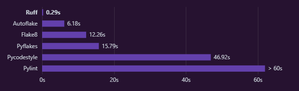
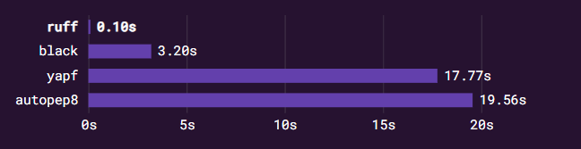
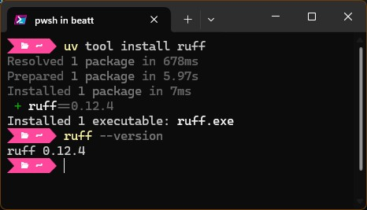
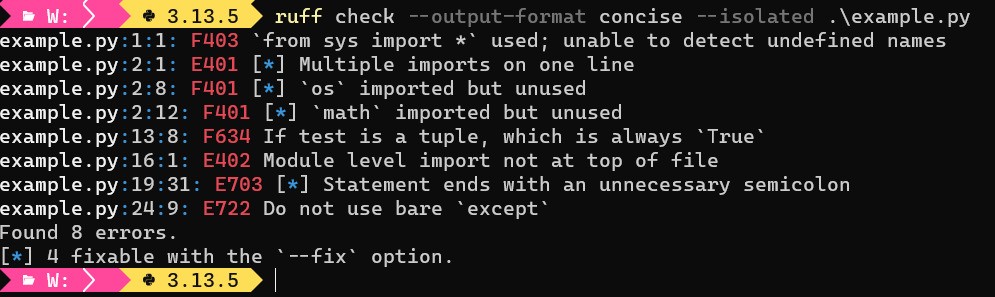
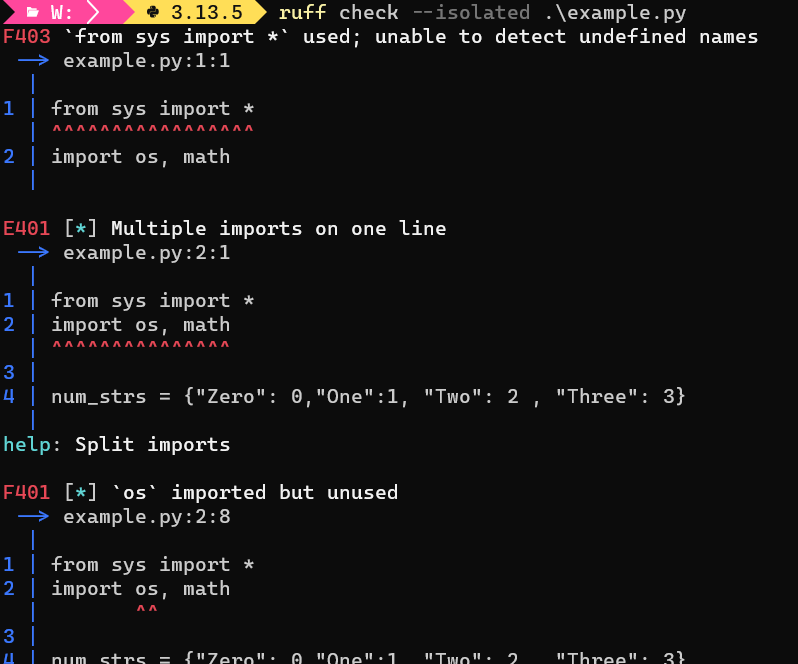
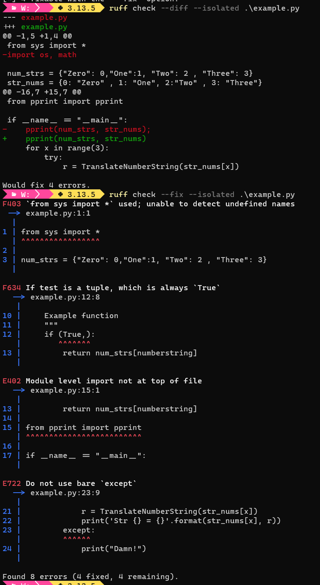
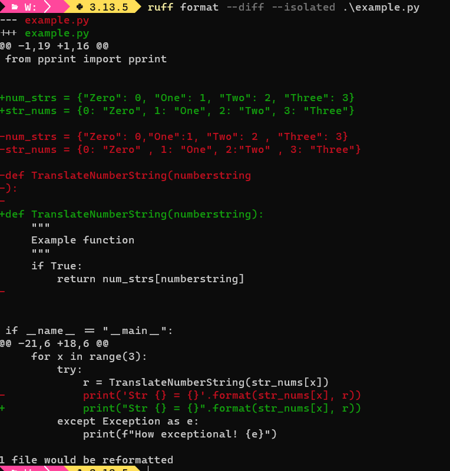

+++
date = '2025-07-18'
draft = false
title = 'Modernizing Python Development: Linting and Formatting with Ruff'
tags = ["Python", "Tools", "Ruff"]
+++


[](https://github.com/astral-sh/ruff)

- [Introduction](#introduction)
- [What are Linters and Formatters](#what-are-linters-and-formatters)
  - [Linters](#linters)
  - [Formatters](#formatters)
  - [Why You Should Use Them](#why-you-should-use-them)
- [What is Ruff?](#what-is-ruff)
- [Getting Started with Ruff](#getting-started-with-ruff)
  - [Installation steps](#installation-steps)
  - [Basic CLI Usage](#basic-cli-usage)
    - [`ruff check --output-format concise .\example.py`](#ruff-check---output-format-concise-examplepy)
    - [`ruff format .\example.py`](#ruff-format-examplepy)
  - [Configuration](#configuration)
    - [Rules](#rules)
  - [Integrating Ruff into your workflow](#integrating-ruff-into-your-workflow)
    - [CLI](#cli)
    - [IDE](#ide)
    - [Pre-Commit](#pre-commit)
    - [GitHub Action](#github-action)
- [Tips](#tips)
- [Conclusion](#conclusion)
- [Further Reading](#further-reading)

---

## Introduction

Python development is evolving—today, code quality and consistency are more important than ever. **Strict** is the new _cool_.

Tools like [Black](https://github.com/psf/black) have made opinionated formatting mainstream, and the need for readable, maintainable, and error-free code is greater than ever—especially as projects grow and AI-driven code/tools become more prevalent.

As [The Zen of Python](https://peps.python.org/pep-0020/) reminds us, "Readability counts". The developer principle ["code is written once but read many times"](https://retrocomputing.stackexchange.com/questions/15724/who-are-we-quoting-when-we-note-that-code-is-written-once-but-read-many-times) is still bandied about. But, maintaining high standards manually can be challenging and time-consuming. That’s where modern linters and formatters come in, helping us catch errors early and keep our codebases clean.

In this post, I’ll share my experience adopting [Ruff](https://docs.astral.sh/ruff/), a fast, mode

---

## What are Linters and Formatters

---

### Linters

Linting is the automatic checking of your code for errors. Code that passes linting will probably run.

Technically, linting is [Static Analysis](https://en.wikipedia.org/wiki/Static_program_analysis), meaning they detect defects without running the code by analysing the syntax. Modern linters will also check for improvements to the code that **may** lead to incorrect results: suggesting more robust or accepted ways to code.

Linters reduce errors and improve the quality of your code and therefore should be enabled in IDE's, where they continuously run in the background. Any CI/CD pipeline or pre-commit process should have linting enabled.

A linter can be thought of as a formatter with syntax rules.

---

### Formatters

A formatter makes your code _pretty_, by standardising the appearance of the code. Formatters only change the presentation of the code, not the code functionality.  
This makes the code easy to read for you and everyone else, and this becomes more important when working in teams.  

Formatters use a set of rules for consistency. There are a number of rules formatters use, the [PEP 8 – Style Guide for Python Code](https://peps.python.org/pep-0008/) is one such set of standardised rules, but there are numerous anti-pattern rules followed by different formatter implementations as well.

A formatter is opinionated in what it thinks _pretty code_ is, but usually those opinions can be enabled/disabled/ignored.

---

### Why You Should Use Them

 _<https://xkcd.com/1695>_

---

## What is Ruff?

[Ruff](https://docs.astral.sh/ruff/) is a fast, modern Python combined linter and formatter from [Astral](https://astral.sh/), the company that developed UV (see [My Switch to UV](https://jbeattie5768.github.io/posts/2025-07-27-modernizing-python-development-my-switch-to-uv/)).

Key features of Ruff:

- Written in Rust....so it's fast
- A linter and formatter in one tool
- Designed as a compatible replacement for multiple existing linters and formatters
- Configurable (enable/disable) rules for linting and formatting
- IDE integration
- Command Line (CLI) usable
- Works for Python >=3.7
  
So Ruff simplifies multiple linters and formatters into a single tool and performs those tasks **fast**. How fast?  
Well, this graph from the Ruff website shows the time taken to _lint_ the whole [CPython](https://github.com/python/cpython) codebase:

 _source: <https://docs.astral.sh/ruff>_

Taken from an Astral blog post, this graph shows the timings to _format_ the ~250k line [Zulip](https://github.com/zulip/zulip) codebase:

 _source: <https://astral.sh/blog/the-ruff-formatter>_

Some of the tools it replaces are:

- [flake8](https://github.com/PyCQA/flake8) _+ dozens of plugins_
- [pylint](https://github.com/pylint-dev/pylint)
- [pyupgrade](https://github.com/asottile/pyupgrade)
- [autoflake](https://github.com/PyCQA/autoflake)
- [refurb](https://github.com/dosisod/refurb)
- [perflint](https://github.com/tonybaloney/perflint)

- [black](https://github.com/psf/black)
- [isort](https://github.com/PyCQA/isort)
- [pydocstyle](https://github.com/PyCQA/pydocstyle)
- [pydoclint](https://github.com/jsh9/pydoclint)
- [tryceratops](https://github.com/guilatrova/tryceratops)

---

## Getting Started with Ruff

---

### Installation steps

Being an Astral tool, there are multiple methods of installing Ruff.  
For me, I want to install Ruff as a system tool, so it is globally available to me all the time. I have UV installed, so I will install using that:

```pwsh
uv tool install ruff
```



If you do not have UV installed (I recommend you do, see [My Switch to UV](https://jbeattie5768.github.io/posts/2025-07-27-modernizing-python-development-my-switch-to-uv/)), you can install directly with PowerShell:

```pwsh
powershell -c "irm https://astral.sh/ruff/install.ps1 | iex"
```

Alternatively you can add it to your project tools as part of your Venv, or be a caveman and use other outdated install methods, e.g., PiP, PiPx:

```pwsh
uv add --dev ruff  # Install into project Development

pip install ruff   # Use one of the outdated install method 
```

See the [Ruff Install Documentation](https://docs.astral.sh/ruff/installation/) if your preferred install method is not mentioned here.

---

### Basic CLI Usage

Once installed, you can run Ruff on the CLI:

```pwsh {hl_lines=[4, 9]}
ruff check           # Recursively lint all files, from this working directory
ruff check .         # Recursively lint all files, from this working directory
ruff check test.py   # Lint specific file only 
ruff check *.py      # Lint all Python files in the current directory

ruff format          # Recursively format all files, from this working directory
ruff format .        # Recursively format all files, from this working directory
ruff format test.py  # Format specific file only
ruff format *.py     # Format all Python files in the current directory
```

The same is true if you did not install Ruff, but want to run the tool from within a UV cached environment via [UVX](https://docs.astral.sh/uv/concepts/tools/#execution-vs-installation):

```pwsh {hl_lines=[1]}
# uvx is an alias for uv tool run
uvx ruff check       # Recursively lint all files, from this working directory
uvx ruff format      # Recursively format all files, from this working directory
```

---

That's all there is to it, two simple commands to lint and format.  
The results of running either command are the important thing. As an example, lets take this, highly contrived, simple Python file that has syntax errors and formatting issues:

```python {linenos=inline}
from sys import *
import os, math

num_strs = {"Zero": 0,"One":1, "Two": 2 , "Three": 3}
str_nums = {0: "Zero" ,1:"One",  2:"Two" , 3: "Three"}

def TranslateNumberString(numberstring
):

    """
    Example function
    """
    if (True,):
        return num_strs[numberstring]

from pprint import pprint

if __name__ == "__main__":
    pprint(num_strs)
    pprint(str_nums)
    for x in range(3):
        try:
            r = TranslateNumberString(str_nums[x])
            print('Str {} = {}'.format(str_nums[x], r))
        except:
            print("Damn!")
```

---

#### `ruff check --output-format concise .\example.py`

So I am linting this file and I've made the output _concise_ (default is _full_), and passed i the `--isolated` flag so Ruff will ignore my config files and use the defaults instead (see [Configuration](#configuration)).  I did say this was _contrived_).



Even from those few lines of rushed code I've got 8 syntax errors.

The _full_ format explains in more detail each fault found, for example:

`ruff check .\example.py`

```pwsh
# Both lines are equivalent
ruff check example.py
ruff check --output-format full example.py  
```



The linter cannot always fix detected issues, for the rules the linter can fix see the legend in the [Ruff Rules Documentation](https://docs.astral.sh/ruff/rules/#legend).

In this example there are 4 errors fixable automatically (those with [*]). Lets fix the easy ones automatically as they are simple errors:

```pwsh
ruff check --diff example.py  # Show what the changes 'would' be
ruff check --fix example.py   # Apply the changes
```



 You may get fixes that Ruff has classed as being unsafe, indicating that the _meaning_ of your code **may** change with those fixes. There are none in the example, but the commands to fix the unsafe-fixes are similar:

```pwsh
ruff check --unsafe-fixes --diff example.py  # Show what the changes 'would' be
ruff check --unsafe-fixes --fix example.py   # Apply the changes
```

Now we are down to 4 errors for our example, but there are no auto fixes for those. Lets go read the docs for each errored rule and fix them manually:

- F403 `from sys import *` used; unable to detect undefined names
  - Yes, star imports are bad, change to `import sys`
- F634 If test is a tuple, which is always `True`
  - Change to `if True:`
- E402 Module level import not at top of file
  - Move import to the top
- E722 Do not use bare `except`
  - Change to `except Exception as e:`
  
Sometimes when you fix an issue, you will get another, in this case I got another `F401 'sys' imported but unused` error, which I also fixed. You always need to run the linter again until all the errors have been resolved.

A mentioned, errors state what the problem is and give a rule number (e.g., [F403](https://docs.astral.sh/ruff/rules/undefined-local-with-import-star/)) that you can look up on the Ruff [Rules](https://docs.astral.sh/ruff/rules/) pages to get more information and suggestions on how to fix.  

>Note: When used within an IDE, hyperlinks are provided to quickly get information on the error.
{.note}

Now we have all checks passing:


---

#### `ruff format .\example.py`

Before we format the remaining code, lets take a look at what would be changed:

```pwsh
ruff format --diff .\example.py  # Show what the changes 'would' be
```



Again I am using the `--isolated` option to use the default rules only.  
Lets accept those changes and let Ruff format the code:

```pwsh
ruff format .\example.py   # Apply the formatting changes
```

The final code is now:

```python
from pprint import pprint

num_strs = {"Zero": 0, "One": 1, "Two": 2, "Three": 3}
str_nums = {0: "Zero", 1: "One", 2: "Two", 3: "Three"}


def TranslateNumberString(numberstring):
    """
    Example function
    """
    if True:
        return num_strs[numberstring]


if __name__ == "__main__":
    pprint(num_strs)
    pprint(str_nums)
    for x in range(3):
        try:
            r = TranslateNumberString(str_nums[x])
            print("Str {} = {}".format(str_nums[x], r))
        except Exception as e:
            print(f"How exceptional! {e}")

```

Although the code runs and does what was intended, there are still _issues_ with this code. Linters and formatters are only there to help you, not replace you!

---

### Configuration

The rules used by Ruff are derived from multiple linters and formatters, and are configurable through hierarchical TOML files.

Whether Ruff is used as a linter, a formatter or both, configuration follows the same methodology. Ruff will search for a configuration file in one of the following files `.ruff.toml`, `ruff.toml` or `pyproject.toml` in the closest directory and in that order of preference. Alternatively you can specify any TOML file with the `--config` option.

It is normal to include Ruff configuration in your project `pyproject.toml` file, as the Ruff configuration can be included in the projects version control.  
The majority of projects using Ruff, as [listed by Astral](https://github.com/astral-sh/ruff#whos-using-ruff), use their existing `pyproject.toml` to store their Ruff configuration. For example:

[FastApi using `pyproject.toml`](https://github.com/fastapi/fastapi/blob/master/pyproject.toml)  
[Pandas using `pyproject.toml`](https://github.com/pandas-dev/pandas/blob/main/pyproject.toml)  
[Polars using `pyproject.toml`](https://github.com/pola-rs/polars/blob/0c4650f1e066e3c02507df8a778f0ff02c352a48/py-polars/pyproject.toml)

>As an aside, SCiPy has renamed their Ruff config file `lint.toml` and explicitly referenced it in calling Ruff with the `--config` option.  
[SciPy `lint.toml`](https://github.com/scipy/scipy/blob/432ce1a23d6a534d5a8845488229c7f2f1b5a100/tools/lint.toml)  
[SciPy calling Ruff with the `--config` option](https://github.com/scipy/scipy/blob/432ce1a23d6a534d5a8845488229c7f2f1b5a100/tools/lint.py#L72-L81)
{.note}

There is no reason to not have a separate `ruff.toml` in your project directory.

That's all well and good, but what if we don't have a project, but still want to check certain files on the command line. We have 4 options:

1. Add a `pyproject.toml` to the directory
2. Add a `ruff.toml` to the directory
3. Use the `--config` option and point to an existing `ruff.toml` located elsewhere
4. Have a default _global_ `ruff.toml` that will be used if no other configuration file is located.

For me, #4 is the preferred option for the way I work (although I am trying to use `pyproject.toml` more often, even for _sandbox_ directories). I now have a default `ruff.toml` in my Windows home directory and a symbolic link to the Ruff directory:

```pwsh {hl_lines=[3]}
# Needs to be run as *PowerShell Admin (only Admin can create links)
# Use '-Force' in case '\AppData\Roaming\Ruff' dir has not been created
New-Item -ItemType SymbolicLink -Force -Path "$env:USERPROFILE\AppData\Roaming\Ruff\ruff.toml" -Target "$env:USERPROFILE\ruff.toml"
```

IMHO, Ruff is a little lacking in not allowing a home directory default/fallback configuration file. Instead it has its [file discovery](https://docs.astral.sh/ruff/configuration/#config-file-discovery), one of which is the `${config_dir}/ruff/` directory. For Windows, the `$(config_dir)` is equivalent to `%userprofile%\AppData\Roaming` and if there is a `pyproject.toml` or `ruff.toml` located in the associated Ruff directory, that TOML will be used if no local config file is found.

---

#### Rules

Ruff rules are based around codes, **_\[Letter Prefix][Number Code]_**, e.g., F841.  
The letter prefix indicate groups that are the source of the rule. This becomes more obvious when you look at the online [Rules Documentation](https://docs.astral.sh/ruff/rules/).

Additionally there are [Settings](https://docs.astral.sh/ruff/settings/) which work alongside rules and define some rule parameters. For example, [`E501`](https://docs.astral.sh/ruff/rules/line-too-long/) is "_line too long_" which has a default of 88, but the Setting `line-length` allows you to define the length after-which this rule will be triggered, e.g.,:

```toml {hl_lines=[1]}
# pyproject.toml
[tool.ruff]
line-length = 120  # Allow lines to be as long as 120.
```

---

The best way to start with your Ruff config is to add all rules, or the default set of group rules, and remove rules as they annoy you:

```toml {hl_lines=[1]}
# pyproject.toml
[tool.ruff.lint]
select = ["ALL"]
```

```toml {hl_lines=[1]}
# pyproject.toml
[tool.ruff.lint]
# RUFF DEFAULTS
select = [
    "F",    # pyflakes – detects syntax errors and basic mistakes
    "E4",   # pycodestyle errors (part of E group)
    "E7",   # pycodestyle E7xx errors (naming, etc.)
    "E9",   # pycodestyle E9xx errors (syntax)
]
```

---

I've opted to add all rules and remove them as they annoy me. Defining `"ALL"` will at least mean that if any new rules are implemented, I will not miss the chance for those rules to annoy me.

```toml {hl_lines=[1]}
# ruff.toml
# Settings
line-length = 120  # Keep aligned with .editorconfig

[format]
line-ending = "lf" # Use `\n` line endings

[lint]
select = ["ALL"]

ignore = [
    "ANN",    # flake8-annotations - MyPy is checking annotations
    "S311",   # flake8-bandit - cryptographically weak `random` used
    "RET504", # flake8-return - unnecessary assignment before `return` statement
    "D200",   # pydocstyle - unnecessary multiline docstring
    "D203",   # pydocstyle - blank line before class docstring
    "D212",   # pydocstyle - docstring not on 1st line after opening quotes
    "D400",   # pydocstyle - missing trailing period in docstring
    "D401",   # pydocstyle - docstring first lines are not in an imperative mood
    "D415",   # pydocstyle - missing terminal punctuation (.,? or !)

    # "PERF401" # Perflint - `for` loop can be replaced by list comprehension

    # Consider removing these for projects/publication
    "D1",     # pydocstyle - missing docstring
    "ERA001", # eradicate - found commented out code
    "T201",   # flake8-print - `print` found
    "T203",   # flake8-print - `pprint` found
]

[lint.per-file-ignores]
"tests/*.py" = ["S101"]  # Use of `assert` detected
"test_*.py"  = ["S101"]  # 
```

At the moment this gets me through most of my scripts and is small enough to transfer to a `pyproject.toml` if needed.

There are plenty of example [GitHub projects using Ruff]((https://github.com/astral-sh/ruff#whos-using-ruff)) to show examples of configuration.

---

### Integrating Ruff into your workflow

#### CLI

See [Basic CLI Usage](#basic-cli-usage).

---

#### IDE

As usual, Astral have done a great job with the [Editors Setup Documentation](https://docs.astral.sh/ruff/editors/setup/).

I use VSCode and its pretty simple:

1. Install and enable the [Ruff Extension](https://marketplace.visualstudio.com/items?itemName=charliermarsh.ruff) from the Visual Studio Marketplace.
2. Configure Ruff to be the default and take action on save:

   ```yaml {hl_lines=[3, 4, 5, 7]}
    // Editor: Python Specific Settings
    "[python]": {
      "editor.defaultFormatter": "charliermarsh.ruff",
      "editor.formatOnSave": true,
      "editor.codeActionsOnSave": {
        // "source.fixAll": "explicit",
        "source.organizeImports": "explicit",
      },
    },
   ```

You can include and exclude rules in the `settings.json`, but they are better placed in a project TOML file.

Once installed in VSCode, Ruff will automatically execute when you open or edit a Python file.


You can click the rule in the _Problem_ panel and get sent to a webpage explaining that rule. You can right click the issue and select auto-fix, ignore, etc. All good stuff.

---

#### Pre-Commit

If you have [pre-commit](https://pre-commit.com/) setup for your project, you can add the [ruff-pre-commit](https://github.com/astral-sh/ruff-pre-commit) to it as well

```yaml {hl_lines=[1]}
# .pre-commit-config.yaml
repos:
- repo: https://github.com/astral-sh/ruff-pre-commit
  # Ruff version.
  rev: v0.12.10
  hooks:
    # Run the linter.
    - id: ruff-check
      # args: [ --fix ]
    # Run the formatter.
    - id: ruff-format
```

---

#### GitHub Action

If you have [GitHub Actions](https://docs.github.com/en/actions/get-started/quickstart) setup for your project, you can add a [ruff-action](https://github.com/astral-sh/ruff-action) to it as well. Either as a file:

```yaml {hl_lines=[1]}
# ruff.yml
name: Ruff
on: [ push, pull_request ]
jobs:
  ruff:
    runs-on: ubuntu-latest
    steps:
      - uses: actions/checkout@v4
      - uses: astral-sh/ruff-action@v3
```

...or adding the following to your CI/CD workflow:

```yaml
      - uses: astral-sh/ruff-action@v3
```

---

## Tips

- **What config file is it using now?**
  - **CLI**: add `--verbose` and it will one of the first things printed
  - **VSCode**: Add the following to your workspace settings:

    ```yaml
    "ruff.logLevel": "debug",
    "ruff.logFile": "c:/temp/ruff.log",
    ```

    - The log will show which TOML is being used (there may be more than one referenced in the log)

- **How do I get Ruff to ignore this line only?**
  - Sometimes not everything is fixable, or needs to be fixed
  - Add `# noqa: <rule>` to the line, e.g., `# noqa: D201`, and it will get ignored

- **I like [Black](https://github.com/psf/black), can I use it as well as Ruff?**
  - **CLI**: No problem. They are different sections of the `pyproject.toml` file
    - **Important**: Make sure the `line-length` setting is the same for both or they will forever fight each other
    - Run `ruff check example.py` and `black example.py` as you normally would on the CLI
  - **VSCode**: You can set Black to be the Formatter and Ruff to be the Linter in the `settings.json` file
  
    ```yaml {hl_lines=[1]}
    # settings.json
    "ruff.lint.enable": true,
    ...
    ...
    "python.formatting.provider": "black",
    ...
    ...
    ```

- **I don't want it to format a section of code**
  - Add the `# fmt: off`/`# fmt: on` pairing around the code you do not want formatted. These need to be on their own lines.
  - For single lines, use `# fmt: skip` after the command to be left unchanged.
  - Examples for both options:
  
  ```python  linenos=inline hl_lines=[1,5, 12] style=monokai}
    # fmt: off
    for status in [(-1, -1), (-1, 0), (-1, 1),
                   ( 0, -1),          ( 0, 1),  # show (row,col) offset
                   ( 1, -1), ( 1, 0), ( 1, 1)]:
    # fmt: on
        print(f"Status: {status}")

    # Ruff Formatting would change this to be:
    for status in [(-1, -1), (-1, 0), (-1, 1), (0, -1), (0, 1), (1, -1), (1, 0), (1, 1)]:
        print(f"Status: {status}")

    import pdb; pdb.set_trace()  # fmt: skip

    # Ruff Formatting would change this to be:
    import pdb
    
    pdb.set_trace()
  ```

---

## Conclusion

Improving your code should be as painless as possible. The coverage and speed of Ruff helps greatly, but I think the biggest benefit I have seen is that I am learning from it.  

The speed helps with the feedback-loop.  

The use of TOML files is simple and easy to add/remove rules to.  

Don't get bogged down with it, instead embrace it as you move forward.

---

## Further Reading

- [Ruff Documentation](https://docs.astral.sh/ruff/)
- Other Python code analysis tools that can give early warnings about certain aspects of your code, such as a complexity metric:
  - [Radon](https://github.com/rubik/radon)
  - [complexipy](https://github.com/rohaquinlop/complexipy)
  - [A study testing how effective Cognitive Complexity is](https://www.sciencedirect.com/science/article/abs/pii/S0164121222002370)

---

Edits to this Post

05 Jan 2025: Added _"I don't want it to format a section of code"_ entry to [Tips](#tips) section.
05 Jan 2025: Added banner image and updated some formatting.
