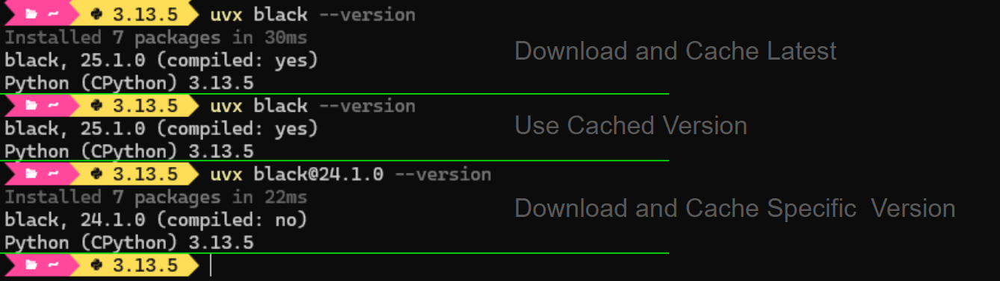
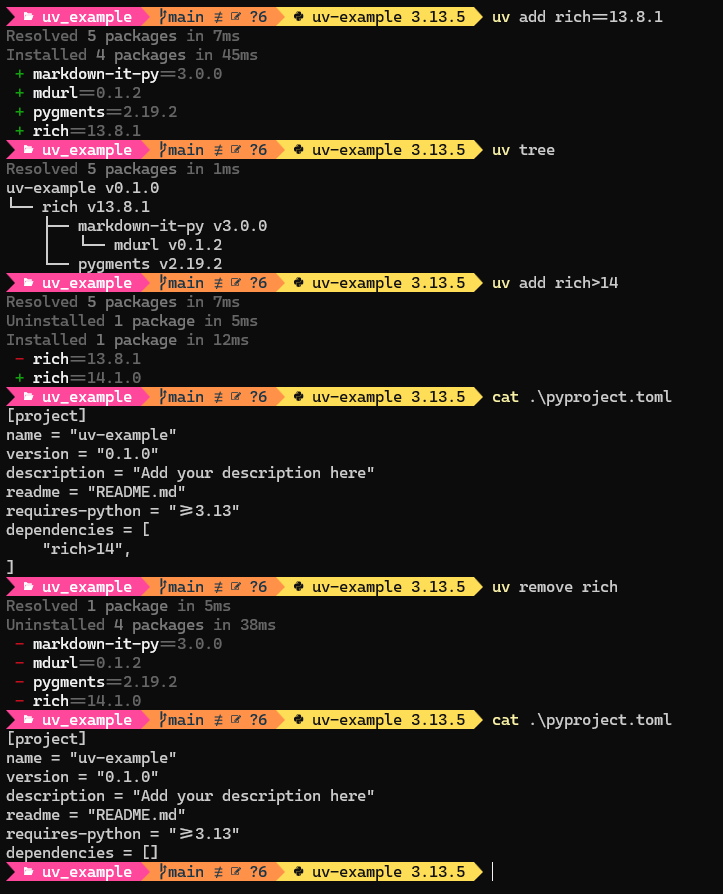
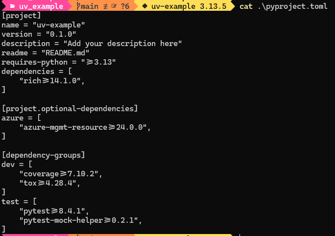
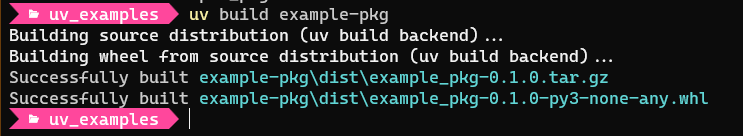
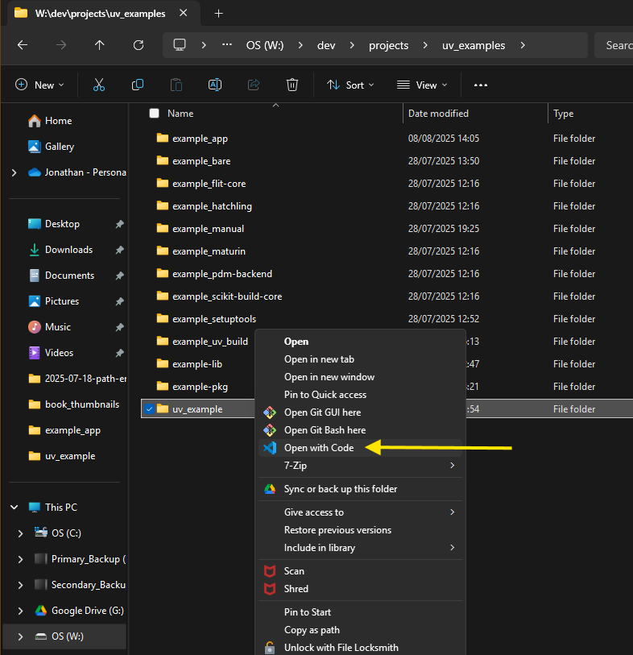
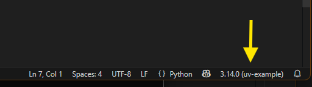

+++
date = '2025-07-27'
draft = false
title = 'Modernizing Python Development: My Switch to UV'
tags = ["Python", "Tools", "UV"]
+++

______________________________________________________________________

## Introduction 🚀

Python development is evolving rapidly, and [UV](https://docs.astral.sh/uv/) is at the forefront of this transformation. In this post, I wanted to document my experience switching to UV, why and I how I've started the move to a modern workflow.

______________________________________________________________________

## Main Content

### Why Now? ⏰

The Python ecosystem is changing, and UV is a major addition to the modern toolkit. With a new Windows 11 laptop and a growing appreciation for PowerShell 7, it was the perfect opportunity to embrace UV and other up-to-date tools. Astral, the company behind UV and Ruff, has made cross-platform support seamless, and their documentation is clear for all major operating systems, but I will focus on WIndows.

### I'm No Expert 🤓

UV is evolving quickly, and I'm not an expert, the official documentation is excellent and always being updated. I encourage everyone to check the [UV docs](https://docs.astral.sh/uv/) for the latest features and best practices.

______________________________________________________________________

### How I Use UV 🛠️

#### Installation

There are several ways to install UV, but for PowerShell, I used:

```pwsh
powershell -ExecutionPolicy ByPass -c "irm https://astral.sh/uv/install.ps1 | iex"
```

This installs `uv.exe` into `$HOME/.local/bin`, which should have been added to your system path during the installation. For enhanced productivity, enable [shell autocompletion](https://docs.astral.sh/uv/getting-started/installation/#shell-autocompletion) for both UV and UVX commands.\
After installing, you can check your installation with `uv --version` and update UV anytime with `uv self update`.

In `$HOME/.local/bin` you should have:

| Executable | Description
|------------|-------------
| uv.exe | UV executable
| uvw.exe | Alias for `uv` [without a console window on Windows](https://github.com/astral-sh/uv/pull/11786).\
| | i.e. doesn't create a visible console window
| uvx.exe | Alias for `uv tool run`

______________________________________________________________________

#### Key Features

- **Python Version Management**: Install, upgrade, and manage multiple Python versions easily.
- **Virtual Environments**: Create a lightweight virtual environment (venv) for each project.
- **Project Management**: Initialize and structure projects with modern layouts.
- **Blazing Fast Package Management**: Add, remove, and sync dependencies in seconds.

______________________________________________________________________

#### Python Versions 🐍

UV lets you use your own installed Python versions ("_System Versions_") or installs them directly ("_Managed Versions_"). Astral provides their own [Managed Python Distributions](https://docs.astral.sh/uv/concepts/python-versions/#managed-python-distributions), which are built from the official sources and work seamlessly with UV.\
You can still use other installers if you prefer, UV will discover and manage all versions for you.

To install a managed Python build:

```pwsh {hl_lines=[2]}
uv python install                   # Install latest Python version
uv python install 3.13.5 --default  # Add python.exe to $HOME\.local\bin\
uv python install 3.10              # Install latest patch version
uv python install 3.10.5            # Install specific patch version

uv python list                      # List available versions
uv python find 3.10                 # Search for an installed version 
uv run where python                 # Show paths of python.exe 

uv python upgrade 3.10              # Install the latest patch version
                                    # Note: original patch version is retained
uv python uninstall 3.10.5          # Uninstall version

# Run the installed Python
uv run python -c "import sys; print(sys.version)"          # Default Python version
uv run -p 3.14 python -c "import sys; print(sys.version)"  # Specific Python version
```

I've chosen to use only UV-managed versions, with 3.13.5 as my current default. Installing with the `--default` flag ensures `python.exe` is always on my path. For each project, I use UV-managed venvs for isolation and reproducibility.

______________________________________________________________________

#### Virtual Environments (venvs) 🏗️

UV creates and manages lightweight\* virtual environments by default. You can add PiP to a venv with the `--seed` option if needed. UV can auto-create venvs when you add dependencies or run project files. Changing Python versions is as simple as editing `.python_version` and running `uv sync` (the new version additionally needs to satisfy the Python specification in the `pyproject.toml` file).

```pwsh
# pyproject.toml
requires-python = ">=3.13"

# .python_version entry
3.14                        # Installs, satisfies pyproject.toml
3.12                        # Errors, does not satisfy pyproject.toml
```

> \* You will see venvs being described as lightweight. This is because they only add the executables. Builtin modules are linked back to your core standard library. UV is "_extra lightweight_" by not including the PiP module (can be changed).
> {.note}

______________________________________________________________________

#### UV and Tools 🧰

You can install and run Command Line (CLI) tools like Ruff, Black, and MyPy directly with UV. Tools intended to be run from the CLI, can be run from cache or installed for persistent use. The `uvx` alias makes running tools even easier. For frequent tools, install them; for occasional use, run from cache.

```pwsh
uv tool run <tool>  # Run Tool 
uvx <tool>          # UVX is an alias for 'uv tool run'
uvx <tool@version>  # Specify Tool Version: <package@version>

uv cache clean      # Deletes: $HOME\AppData\Local\uv\cache

uv tool install <tool>          # [install | uninstall | upgrade]
uv tool install <tool@version>  # Specify Tool Version: <package@version>
uv tool update-shell            # Ensure Tool Exe on path (if not already)

uv tool dir        # Installed Src: $HOME\AppData\Roaming\uv\tools
uv tool dir --bin  # Installed Exe: $HOME\.local\bin\

uv tool list       # List Installed Tools

# Paths are Windows
```

UVX is the preferred way of running many tools as the tool gets cached anyway. Some tools you may want available outside of UV, Ruff for example, and this is where you can install the tool and use it on its own (remember, the tool executable is on your path).



______________________________________________________________________

#### Package Dependencies 📦

UV manages dependencies for all your environments quickly and reliably. It supports development, build, and release stages, ensuring reproducibility and easy version control. Use `pyproject.toml` for requirements, and let UV handle the lock file and syncing.

1. **Development** - Be able to reproduce your development environment if the worst happens. There may also be packages not required at run time (linters, testers, etc).
1. **Build** - When you publish or deploy your application you want to be able to have a lean build with no extraneous packages.
1. **Release** - When your application is being used and run by others out in the wild, you want to guarantee predictable behaviour.

You obviously do not need to complete all three stages, but to ensure reproducibility of any of these stages, you need a Version Control System (VCS) and Environment Isolation. This normally means four things:

1. **Definition File** - Specify the broad requirements of the project. UV uses [TOML](https://github.com/toml-lang/toml) file format and adheres to various Python PePs for it (e.g. PeP [508](https://peps.python.org/pep-0508/), [517](https://peps.python.org/pep-0517/), [518](https://peps.python.org/pep-0518/)), The definition file is `pyproject.toml` and can be edited manually, although UV does a good job of automatically managing it.
1. **Lock File** - UV has a `uv.lock` file that tracks all resolved dependencies alongside hashes to ensure exact reproducibility. This is under UV Management and should not be manually edited.
1. **Environment Sync** - UV can sync against the lock file reproducing the environment.
1. **Track in VCS** - You should version control the `pyproject.toml` and `uv.lock` files. UV assumes Git, but [any VCS](https://docs.astral.sh/uv/reference/cli/#uv-init--vcs) is better than nothing.

Adding packages to your project is fast and simple:

```pwsh
uv add <pkg1,...>     # Add one or more dependencies to the project
uv remove <pkg1,...>  # Remove dependencies from the project

uv add -r requirements.txt  # Add all in the given `requirements.txt`
                            # Likely from a legacy project

uv tree                       # View the dependency tree for the project
uv tree --outdated --depth 1  # View latest available versions

uv sync               # Sync environment from uv.lock 
uv lock               # Create uv.lock (happens automatically anyway)
```



> Disappointingly, there is no current `--upgrade` option to update installed packages. This is likely coming (see [Upgrade dependencies in pyproject.toml (uv upgrade) #6794](https://github.com/astral-sh/uv/issues/6794)), but until then I do:
> {.note}

```pwsh
# Manually edit 'pyproject.toml' to change package version(s), then...
uv sync ---upgrade
```

You can use the standard Dependency [Version Specifiers](https://peps.python.org/pep-0440/#version-specifiers) for packages as follows:

| Specifier | Description | Example
|--------|----------------|----------
| ~= | Compatible release | ~= 1.1
| == | Version matching | == 1.1.1
| != | Version exclusion | != 1.0
| \<=, >= | Inclusive ordered comparison | >= 1.1
| === | Arbitrary equality (future Use) | ===1.1.1
| \<, > | Exclusive ordered comparison | >1.1

You can use these in the `pyproject.toml` file, or manually on the CLI:

```pwsh
uv add rich                     # Install latest
uv add rich==13.8.1             # Install specific version
uv add rich<13.8.100            # Install closest version below 
uv add rich>13.9.1 rich<13.9.3  # Install version between
```

When you add a package, it gets added to the `pyproject.toml` default dependencies section, meaning that it will be included if the project was built. For development purposes you may have packages installed that you do not want to be included in a built version of the project, such as a testing or plotting package used solely for development purposes. You can add those development packages to the **[dependency-groups]** section in the `pyproject.toml`, as per [PeP 735](https://peps.python.org/pep-0735/).

Within **[dependency-groups]**, you can add sub-groups as well as the defined `dev` and `optional` groups. For example, for testing purposes you may want PyTest and other test packages separately added to a `test` development dependency group:

```pwsh
# Add packages to the development group of [dependency-groups]
uv add --dev tox coverage
# Add packages to the user named `test` group of [dependency-groups]
uv add --group test pytest pytest-mock-helper
# Optionally add a package
uv add azure-mgmt-resource --optional azure
```

```pwsh
# Remove is the same ordering
uv remove --dev tox coverage
uv remove --group test pytest-mock-helper
uv remove azure-mgmt-resource --optional azure
# Empty entries are left in pyproject.toml (remove manually)
```



You can nest groups, etc, all of which are better detailed in the [UV Dependencies Documentation](https://docs.astral.sh/uv/concepts/projects/dependencies/).

By default, UV uses the Python Package Index [(PyPI)](https://pypi.org/) for packages. There are options to specify another package registry, Github and local files:

```pwsh
uv add --index https://download.pytorch.org/whl/cpu pytorch  # Specific index registry
uv add "C:\temp\pillow-11.0.0-cp313-cp313-win_amd64.whl"     # Local Wheel
uv add "git+https://github.com/sherlock-project/sherlock"    # GitHub repo
```

UV does provide a PiP equivalent interface if you feel more comfortable using PiP: note that this is not installing pip, you are still using UV that has a "_Pip-like_" CLI interface. You can use it as `uv pip [OPTIONS] <COMMAND>`.\
Just a reminder, using these PiP-like commands means the dependencies _are not_ under UV management.

| UV PiP Cmd | Description
|------------------|-------------
| uv pip compile | Compile a `requirements.in` file to a `requirements.txt`
| uv pip sync | Sync to a `requirements.txt` or `pylock.toml` file
| uv pip install | Install packages
| uv pip uninstall | Uninstall packages
| uv pip freeze | List installed packages in requirements format
| uv pip list | List installed packages
| uv pip show | Show information for one or more installed packages
| uv pip tree | Display the dependency tree
| uv pip check | Verify dependency compatibilities

While UV has lots of options, it can be befuddling. For example, for PiP you could have:

| PiP Type | Meaning
|----------------|----------
| uv venv | Default UV venv with **no** PiP added to the venv
| uv venv --seed | UV venv **with** PiP added to the venv
| uv add pip | PiP added as a dependency and managed by UV
| uv pip \<cmd> | PiP-like UV command
| uvx pip \<cmd> | Run PiP as a UV tool

I'd recommend using UV for package management. You always have `uv pip <cmd>` to fall back on or running PiP as a tool

______________________________________________________________________

#### Project Creation 🏗️

There is no single "right" way to structure a Python project. The closest "_standard_" is the Python Packaging Authority (PYPA) who basically show [two types](https://packaging.python.org/en/latest/discussions/src-layout-vs-flat-layout/): Flat Layout and Src Layout, both of which are popular.

UV does not use the PYPA defined Flat layout, instead defaulting to placing all files at the top-level. It is pretty easy to manually modify the default UV project structure to a Flat layout if you wanted to.\
UV does adhere to the PYPA Src layout as an option, with some variations defined by the packaging tools you can optionally specify.

UV can [generate project layouts](https://docs.astral.sh/uv/concepts/projects/init/#creating-projects) for you:

| Project Type | Layout | Description
|--------------|-----------|-------------------------------------------------------------
| Default | Top-Level | Layout for simple tools, scripts, CLi, etc
| Bare | Top-Level | Just the _pyproject.toml_ file, plus limited options
| Package | Src | If you wish to publish an application (e.g. create a Wheel)
| Library | Src | If you wish to specifically package a library

```bash
uv init example_uv                     # Default Project Type
uv init example_bare --bare --vcs git  # Included Git initialisation
uv init --package example-pkg
uv init --lib example-lib

uv init --app example_uv               # Same as Default Project Type

uv version  # Show **Project** version as listed in the pyproject.toml
```

You can initialize projects with different layouts and build-backends, and easily convert between them as your needs evolve. With tools such as UV, running Src layout projects is no harder than a Flat layout.

There seems to be an endless debate on what is the better project layout, but I'm going to start using a Src layout created from the default `uv init` command for applications. I can modify the project layout with either a series of commands, see [Project Conversion](#project-conversion), or combining the commands into a script. Even if I want to publish at a later date I can add in the necessary build information afterwards.\
Simple scripts will continue to use a top-level default UV structure (`uv init` with no layout modification).

If you are going to build your application, you need a build-backend. By default, the build-backend for UV Package and Library projects is the `uv_build` backend to create the packaged project. If you are going to use a different package build tool then you should specify the backend in the project creation:

```bash
uv init --build-backend <Backend Option> <Project Name>
```

| Backend Option | Description
|----------------|------------------
| [uv_build](https://docs.astral.sh/uv/guides/package/#building-your-package) | UV default backend, written in RUST for pure Python packages
| [setuptools](https://github.com/pypa/setuptools) | The Original backend from the Python Packaging Authority
| [hatchling](https://pypi.org/project/hatchling/) | Modern backend from the Hatch project
| [flit_core](https://github.com/pypa/flit) | Simple backend for pure Python packages
| [maturin](https://github.com/PyO3/maturin) | Backend designed for Rust extensions
| [scikit-build-core](https://github.com/scikit-build/scikit-build-core) | Backend that uses CMake to build extension modules

Using the `--build-backend` flag implicitly implies the `--package` flag.

```bash
uv init --build-backend uv_build example_uv_build  # == uv init example_uv_build
uv init --build-backend hatchling example_hatchling 
uv init --build-backend flit-core example_flit-core        
uv init --build-backend pdm-backend example_pdm-backend      
uv init --build-backend setuptools example_setuptools      
uv init --build-backend maturin example_maturin          
uv init --build-backend scikit-build-core example_scikit-build-core
```

To build the packaged project you simply run one of the following:

```bash
uv build              # Current proj
uv build example_pkg  # Named proj 
```



______________________________________________________________________

### Project Conversion

You don't have to create a UV project, you can use your own structure or modify an existing/old project by simply initialising the existing project with UV:

```pwsh
uv init --bare              # Just 'pyproject.toml'
uv init --bare --vcs git    # Included Git initialisation

uv add -r requirements.txt  # Add all in the given `requirements.txt`
```

The bare _init_ command will create the important _pyproject.toml_ file. If the project is not currently Git managed, you should add that as well.

From there, you can use UV to manage the Python versions and dependencies as normal. If there is an existing `requirements.txt` file you can use UV to add packages mentioned in that file (UV will install and add to the `pyproject.toml` file).

If you want to add a package build-backend, you can do: [Add a Build-Backend](#add-a-build-backend)

______________________________________________________________________

#### **Modify To a Src layout Structure**

```pwsh
# PowerShell Commands
uv init example_uv          # Top-level layout 
```

```text {hl_lines=[4]}
EXAMPLE_UV
    .gitignore
    .python-version
    main.py
    pyproject.toml
    README.md
```

```pwsh
# PowerShell Commands
cd example_uv
ni -ItemType Directory src/example_uv  # ni = New-Item
mv main.py src/example_uv   

ni -ItemType File -Path tests/__init__.py -Force
ni -ItemType File -Path docs/Installation.md -Force

ni src/example_uv/py.typed  # Ensure mypy works
```

```text {hl_lines=[10]}
EXAMPLE_UV
│   .gitignore
│   .python-version
│   pyproject.toml
│   README.md
├───docs
│       Install
├───src
│   └───example_uv
│           main.py
│           py.typed
└───tests
        __init__.py
```

______________________________________________________________________

#### **Modify To a Flat Layout Structure**

```pwsh
# PowerShell Commands
cd example_uv
ni -ItemType Directory example_uv  # ni = New-Item
mv main.py example_uv
# ..plus additional directory structure
```

```text {hl_lines=[9]}
EXAMPLE_UV
│   .gitignore
│   .python-version
│   pyproject.toml
│   README.md
├───docs
│       Installation.md
├───example_uv
│       main.py
│       py.typed
└───tests
        __init__.py
```

______________________________________________________________________

#### **Add a Build-Backend**

If you did not select a Package layout, you can manually add a build-backend to your _pyproject.toml_:

```toml
[build-system]
requires = ["uv_build>=0.8.3,<0.9.0"]
build-backend = "uv_build"
```

You will have to change the project structure to match the expected Package layout though.

______________________________________________________________________

### VSCode

Not much you need to do, UV is a separate management tool from the IDE. Don't be fooled by VSCode UV extensions, there are no official ones and 3rd party extensions do goodness knows what and are not needed _IMHO_.

UV is a CLI, you create the project, venv and dependencies on a console (inside VSCode if you want, it makes no difference). Then develop your project as normal in VSCode (editing, testing, running, etc).

The only thing you have to do is ensure VSCode is using the project venv, which is normal whether that venv was created with UV or another tool.

Start VSCode from the project directory on the [console](https://code.visualstudio.com/docs/configure/command-line), or right-click the project directory in File Explorer and "_Open with Code_":

```pwsh
cd $uv_example_proj  # I have PS alias' setup for different projects
code .
```



Whatever method, VSCode should identify the correct Python to use in the bottom right corner (sometimes takes a few seconds):



If none of that works, select the venv interpreter from the Command Palette (_ctrl+shift+p_ or _F1_) and type `Python:Select Interpreter`. The venv should be in the drop down list, otherwise find the executable by browsing to the venv installation (`.venv\Scripts\python.exe`).

______________________________________________________________________

### Example Workflow 📝

```pwsh
cd $projects        # Alias to my projects directory
mkdir uv_example    # Create project directory
# Create a PS alias for this project
Add-Content -Value "$uv_proj=W:\dev\projects\uv_example" -Path $profile -Force
cd $uv_proj

# Initialize project with UV (Top-Level App Layout)
uv init               

# Optionally convert to Src layout (in this case I'm doing it be a script)
W:\dev\projects\utils\convert_uv2src_proj.ps1 uv_example

# Create venv
uv venv

# Open in VSCode
code .
```

______________________________________________________________________

## Conclusion 🎉

Switching to UV will hopefully make my Python development faster, more organized, and future-proof. The tool is evolving quickly, and while there are some concerns about its long-term direction, the benefits far outweigh the risks for most developers. If you want to modernize your workflow, give UV a try!

______________________________________________________________________

______________________________________________________________________

### Summary (mostly) of Commands Used

```pwsh
# Install with PowerShell
######################################################
powershell -ExecutionPolicy ByPass -c "irm <https://astral.sh/uv/install.ps1> | iex"

uv --version    # or 'uv self version'
uv --help       # --help can be used with all commands
uv self update  # Update UV itself

# Manage Python
######################################################
uv python install            # Install latest Python version
uv python install 3.10.5     # Install specific Python version
uv python install --default  # Add python.exe to $HOME\.local\bin\

uv python list               # List available versions
uv python find 3.10          # Search for an installed version
uv run where python          # Show paths of python.exe

uv python upgrade 3.10       # Install the latest patch version

uv python uninstall 3.10.5   # Uninstall version

# Run Python
######################################################
uv run python -c "import sys; print(sys.version)"          # Default  version
uv run -p 3.14 python -c "import sys; print(sys.version)"  # Specific version

# Create Virtual Environment (Venv)
######################################################
uv venv                 # Use the default Python version
uv venv my_venv_name    # Specify the Venv name
uv venv --python 3.14   # Specify the Python version for the Venv
uv venv --seed          # Add the PiP module to the Venv

.venv\Scripts\activate  # PowerShell
deactivate

# UV Tools
######################################################
uvx <tool>          # UVX is an alias for 'uv tool run'
uvx <tool@version>  # Specify Tool Version: <package@version>

uv cache clean      # Deletes: $HOME\AppData\Local\uv\cache

uv tool install <tool>  # [install | uninstall | upgrade]
uv tool update-shell    # Ensure Tool Exe on path (if not already)

uv tool dir        # Installed Src: $HOME\AppData\Roaming\uv\tools
uv tool dir --bin  # Installed Exe: $HOME\.local\bin\

uv tool list       # List Installed Tools

# Add Dependencies - normally into current Venv
######################################################
uv add <pkg1,...>     # Add one or more dependencies to the project
                      # Version Specifiers allowed, e.g. rich>13.9.1
uv remove <pkg1,...>  # Remove dependencies from the project

uv add -r requirements.txt  # Add all in the given `requirements.txt`

uv tree               # View the dependency tree for the project
uv tree --outdated --depth 1  # View latest available versions

uv sync               # Sync environment from uv.lock
uv lock               # Create uv.lock (happens automatically anyway)

uv sync ---upgrade    # Edit pyproject.toml to change package version, then...

# 'pyproject.toml' [dependency-groups]
uv add --dev <pkg1,...>            # Add to the development group
uv add --group test <testpkg>      # Add to user named `test` group
uv add <azurepkg> --optional azure # Add Optional to 'azure' group
                      # Remove is the same ordering,
                      # e.g. "uv remove --dev tox coverage"

# Create UV Project Areas
######################################################
uv init               # Create in CWD, default proj type = --app
uv init example_uv    # Create a named project
uv init --package example-pkg
uv init --lib example-lib
uv version            # _Project_ version,
                      # as listed in the pyproject.toml

# Build Project
######################################################
uv build       # Build using UV or specified Build-Backend
```

______________________________________________________________________

______________________________________________________________________

Further Reading:

- [UV: Documentation](https://docs.astral.sh/uv/)

- [UV: Benchmarks](https://github.com/astral-sh/uv/blob/main/BENCHMARKS.md)

- [PyPA: Python Packaging User Guide](https://packaging.python.org/)

- [PyPA: Writing your pyproject.toml](https://packaging.python.org/en/latest/guides/writing-pyproject-toml/)

- [Cory Doctorow: Enshittification](https://web.archive.org/web/20240208152542/https://www.ft.com/content/6fb1602d-a08b-4a8c-bac0-047b7d64aba5)

- [Stuart Ellis: Modern Good Practices for Python Development](https://www.stuartellis.name/articles/python-modern-practices/)

- [Aditya Ghadge: Why the ‘src’ Layout Beats Flat Folders](https://medium.com/@adityaghadge99/python-project-structure-why-the-src-layout-beats-flat-folders-and-how-to-use-my-free-template-808844d16f35)

- [Niels Cautaerts: Python Dependency Management](https://nielscautaerts.xyz/python-dependency-management-is-a-dumpster-fire.html)
