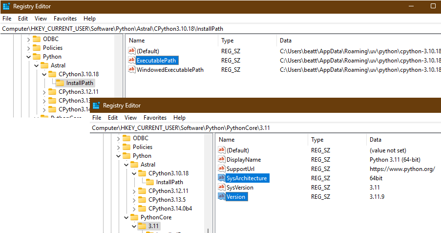
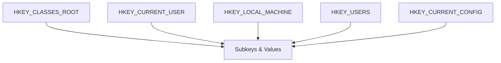
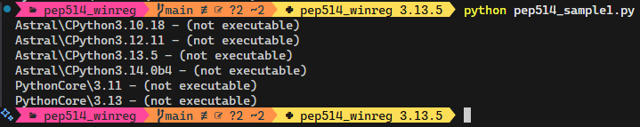
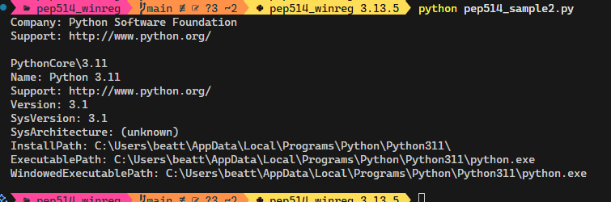
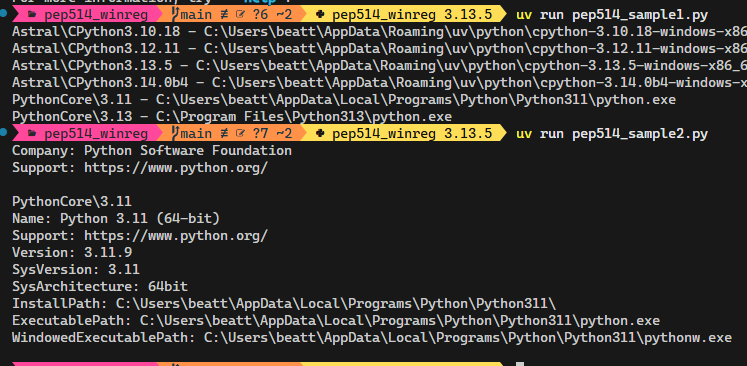
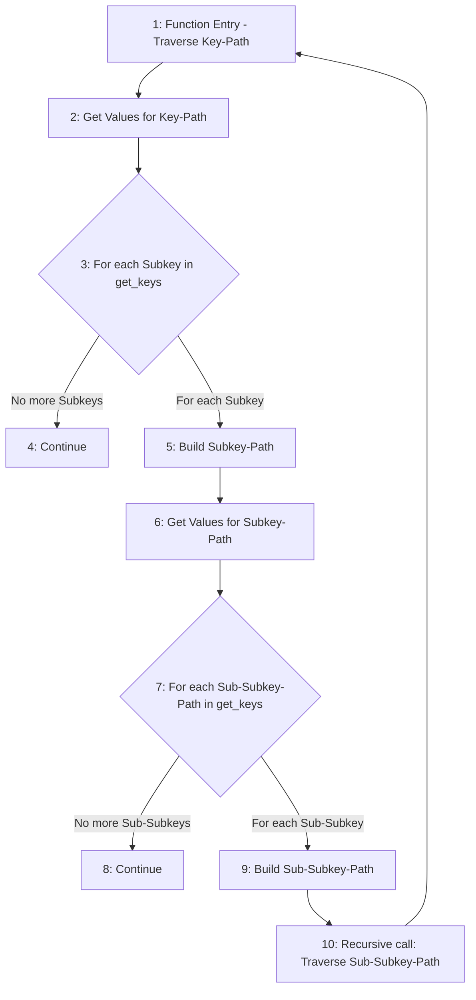
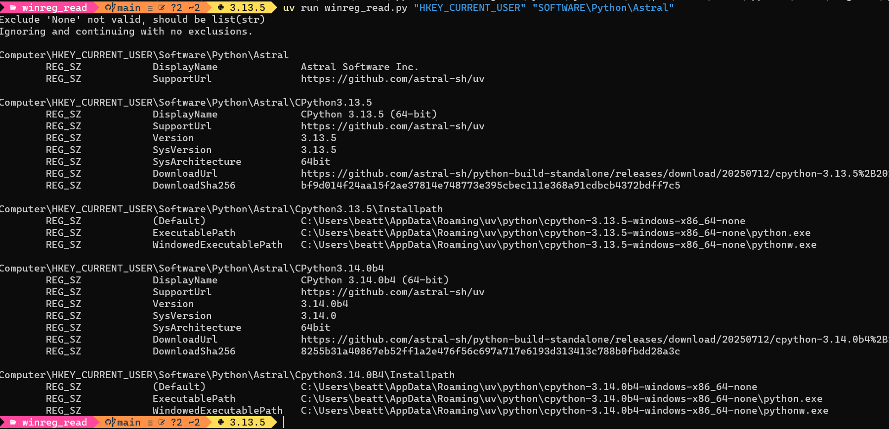
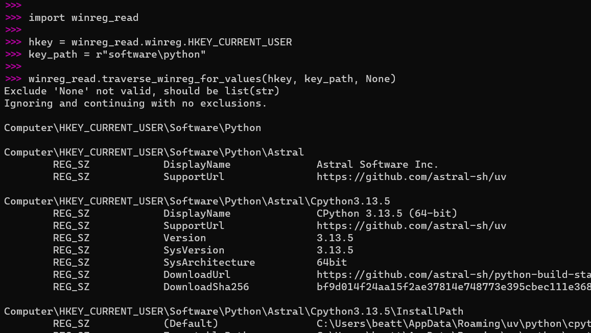
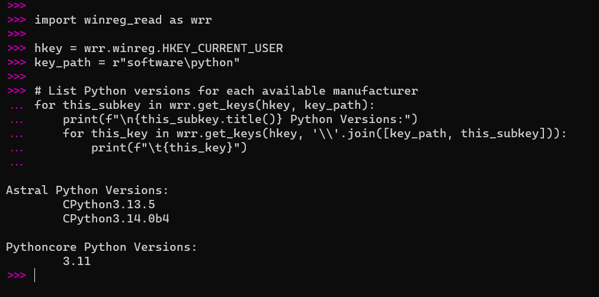
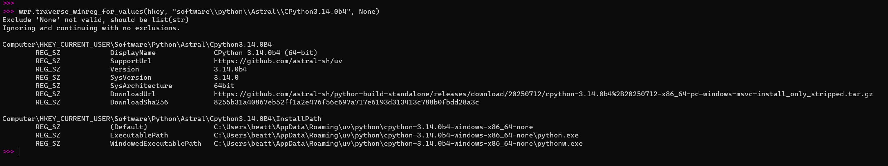

+++
date = '2025-08-01'
draft = false
title = 'Reading the Windows Registry with Python: A Case Study Using WinReg'
tags = ['Python', 'WinReg', 'Windows Registry', 'PEP 514']
+++

______________________________________________________________________

## Table of Contents

- [Table of Contents](#table-of-contents)
- [1. Introduction](#1-introduction)
- [2. Background: What is the Windows Registry?](#2-background-what-is-the-windows-registry)
  - [Structure of the Windows Registry](#structure-of-the-windows-registry)
- [3. The Problem with Sample Code: Lessons from PEP 514](#3-the-problem-with-sample-code-lessons-from-pep-514)
- [4. Exploring the Registry: Exporting and Analysing Data](#4-exploring-the-registry-exporting-and-analysing-data)
  - [Example: Analysing Exported Registry Files](#example-analysing-exported-registry-files)
  - [Example summary of my registry key statistics](#example-summary-of-my-registry-key-statistics)
- [5. Building a Better Registry Reader in Python](#5-building-a-better-registry-reader-in-python)
  - [Getting Keys and Values](#getting-keys-and-values)
  - [Traversing Subkeys via Recursion](#traversing-subkeys-via-recursion)
  - [Printing Results](#printing-results)
  - [Arguments with ArgParse](#arguments-with-argparse)
  - [Issues Found](#issues-found)
  - [Final Tidy](#final-tidy)
- [6. Practical Example: Using the Script](#6-practical-example-using-the-script)
  - [Command-line Examples](#command-line-examples)
  - [Script Examples](#script-examples)
    - [Example 1](#example-1)
    - [Example 2](#example-2)
- [7. Key Takeaways](#7-key-takeaways)
  - [Reading a Registry Value](#reading-a-registry-value)
  - [Writing to the Registry](#writing-to-the-registry)
  - [Deleting a Registry Key or Value](#deleting-a-registry-key-or-value)
- [8. Try It Yourself](#8-try-it-yourself)
  - [Edits to this Post](#edits-to-this-post)

______________________________________________________________________

## 1. Introduction

Curiosity often leads to some of the most interesting projects. After reading about [PEP 514](https://peps.python.org/pep-0514/) in the Astral [UV](https://docs.astral.sh/uv/) documentation, I discovered that Python installations on Windows are registered in the Windows Registry. Intrigued, I tried the sample code from PEP 514, only to find it lacking. This post documents my journey to build a more robust, flexible Python script for reading Windows Registry values. I hope this will be useful to others.



______________________________________________________________________

## 2. Background: What is the Windows Registry?

The Windows Registry is a hierarchical database that stores configuration settings and options for the operating system and installed applications in the form of _Name:Value_ pairs. For Python developers, it’s especially relevant because Python installations are registered here (as per PEP 514), making it possible to discover and manage multiple Python versions programmatically.

### Structure of the Windows Registry

The Windows Registry is similar to a file system. The top-level nodes (hives) are known as root-keys, and each top-level root-key contains subkeys (like folders) and values (like files). The Windows Registry is not case-sensitive.



| Root Key | Purpose |
| --- | --- |
| HKEY_CLASSES_ROOT | Stores information about registered applications, file associations, and COM objects. |
| HKEY_CURRENT_USER | Contains settings and preferences for the currently logged-in user. |
| HKEY_LOCAL_MACHINE | Holds configuration data for the local computer, including hardware and software. |
| HKEY_USERS | Contains user-specific configuration for all users on the system. |
| HKEY_CURRENT_CONFIG | Stores information about the current hardware profile used at system startup. |

A path is made from a root key, keys, subkeys, and values. For example:

```text
Hive (root key): HKEY_CURRENT_USER  
└── Key: Software  
    └── Subkey: Python  
        └── Subkey: Astral  
            └── Subkey: CPython3.13.5  
                └── Value: InstallPath
```

- A key (or subkey) is like a folder—it can contain additional subkeys and values.
  - _CPython3.13.5_ is a subkey. It can contain more subkeys (like _InstallPath_) and/or values (like _Default_, _ExecutablePath_, etc.).
- A value is a _Name:Value_ pair stored inside a key. It does not contain further subkeys or values.
  - _InstallPath_ can be either a subkey (if it contains more subkeys/values) or a value (if it is just a _Name:Value_ pair).

> The term "_hive_" is often used in documentation for the Windows Registry and appears to be specific to Windows, used by Microsoft to describe the files and top-level sections of the registry.
{.note}

______________________________________________________________________

## 3. The Problem with Sample Code: Lessons from PEP 514

When I first tried the two blocks of [sample code from PEP 514](https://peps.python.org/pep-0514/#sample-code), I expected it to work out of the box. Instead, it returned incomplete or misleading results:




From looking at the Windows RegEdit application I knew this code was not reporting the correct values.

Reading the Python [WinReg](https://docs.python.org/3/library/winreg.html) module documentation, we can get the code samples working by replacing the `winreg.QueryValue()` function call with the recommended `winreg.QueryValueEx()` function call and unpacking the returned _value_. This now gives:



That simple change, and removing the access mask to open the key (sample #1 only), has gotten us further. The fields are now looking better for those handled.

The [Modified PEP 514 Sample Code](https://github.com/jbeattie5768/winreg_read/tree/main/pep514_sample_code) is on my GitHub.

I can see there is still more information we can access for the Python entries not handled by the sample code though.

______________________________________________________________________

## 4. Exploring the Registry: Exporting and Analysing Data

To better understand the registry’s structure, I exported sections of it using the Windows `regedit.exe` application and analysed the resulting files in the REPL. This helped me see the variety of data types and key/value patterns present.

The `regedit.exe` application does not allow you to export (dump) the whole registry as a single text file. You have to export the registry piecemeal, which in itself is a bit of a warning sign that there is a **lot** of data.

For my system, there can be a large number of keys to traverse depending on the root HKEY chosen:

| Filename | File Size | Line Count | Key Count |
| --- | --- | --- | --- |
| regdump_HKEY_CURRENT_CONFIG.txt | 3.65 (KB) | 58 | 12 |
| regdump_HKEY_CURRENT_USER.txt | 73.45 (MB) | 611842 | 18402 |
| regdump_HKEY_USERS.txt | 100.40 (MB) | 898276 | 35469 |
| regdump_HKEY_CLASSES_ROOT.txt | 122.69 (MB) | 1931975 | 201571 |
| regdump_HKEY_LOCAL_MACHINE.txt | 553.31 (MB) | 7558804 | 529983 |
| _Totals_ | _849.85 (MB)_ | _11,000,955_ | _785,437_ |

I'm not seeking much, just some idea of what is present. The following code is an example of what was run in the REPL as I was exploring the data, but it is runnable [as a script on my GitHub](https://github.com/jbeattie5768/winreg_read/tree/main/utils). Python is capable of handling all these files simultaneously:

### Example: Analysing Exported Registry Files

```python
# file_analyse.py
import fileinput
from pprint import pprint

tuple_of_files = (
    "regdump_HKEY_CLASSES_ROOT.txt",
    "regdump_HKEY_CURRENT_CONFIG.txt",
    "regdump_HKEY_CURRENT_USER.txt",
    "regdump_HKEY_LOCAL_MACHINE.txt",
    "regdump_HKEY_USERS.txt",
)
# Registry files exported via regedit are typically encoded in UTF-16 
# Some 'locale' characters will not be compatible with UTF-8
with fileinput.input(files=tuple_of_files, encoding="utf-16") as fid:
    data = list(fid)

# What Can we find out about Keys
keynames = []
for this_line in data:
    if this_line.startswith("Key Name:"):
        # Note: Keys may contain whitespace
        keynames.append(this_line.split("Key Name:")[1].strip())
print(f"Key Count: {len(keynames)}\n")
pprint(keynames[:12])  # Print 1st 12
# It is likely that the longest and deepest key-paths are the same..
longest_path = max(keynames, key=len)
print(f"\nLongest key-path is {len(longest_path)} characters.")
print(f"With {len(longest_path.split('\\'))} keys in it:\n")
print(longest_path)  # The actual key-path

deepest_path = max(keynames, key=lambda x: len(x.split("\\")))
print(f"\nDeepest key-path is {len(deepest_path)} characters.")
print(f"With {len(deepest_path.split('\\'))} keys in it:\n")
print(deepest_path)  # The actual key-path

# As anticipated, Key Names are like paths
# i.e., the path is made up of keys and subkeys
... # additional code is available on GitHub
```

### Example summary of my registry key statistics

```text
Line Count: 11000955
Lines Blank: 2017686
...which accounts for 18.34% of all lines
...removed blank lines, which has reduced line count by 18.34%
Updated Line Count: 8983269
Key Count: 785437
Longest key-path is 407 characters.
With 28 keys in it
Deepest key-path is 407 characters.
Duplicate Keys = False

HKEYS listed:
{'HKEY_CLASSES_ROOT', 'HKEY_CURRENT_CONFIG' 'HKEY_CURRENT_USER', 'HKEY_LOCAL_MACHINE', 'HKEY_USERS'}

Types found:
{'REG_BINARY', 'REG_DWORD', 'REG_EXPAND_SZ', 'REG_FULL_RESOURCE_DESCRIPTOR',
 'REG_MULTI_SZ', 'REG_NONE', 'REG_QWORD', 'REG_RESOURCE_LIST',
 'REG_RESOURCE_REQUIREMENTS_LIST', 'REG_SZ', 'REG_UNKNOWN'}

The most common Class Name entries (Name, Count):
[('<NO CLASS>\n', 783641), ('REG_SZ\n', 1090), ('Shell\n', 694),
 ('Network ComputerName\n', 2), ('1aa506ff\n', 2), ('adda2636\n', 2),
 ('5c15e5ed\n', 2), ('2c356ba6\n', 2), ('DynDRootClass\n', 2)]
```

There are a large number of keys (>780,000) and the longest key-path is substantial (28 keys or 407 characters).
There is one value _Type_ not defined in the Python `WinReg` module, which is `REG_UNKNOWN`. This occurs when the _Type_ is an undefined hexadecimal value. We can either print the hex value or follow suit and use `REG_UNKNOWN`.

_Class Name_ entries appear in the exported text files, but not in the RegEdit application itself. I think this is the RegEdit exporter being clever by cross-referencing the _Class_, _ClassID_ and _ClassGuid_ '_Name_' entries defined elsewhere in the registry.\
_**Update**_: _I have subsequently confirmed that 'Class Name' entries cannot be accessed in the registry using the Python WinReg module, and therefore it is safe to ignore these._

This post focuses on 64-bit Windows; accessing 32-bit applications is not covered. You may need to investigate further if you have to worry about 32-bit access – see [Accessing an Alternate Registry View](https://learn.microsoft.com/en-gb/windows/win32/winprog64/accessing-an-alternate-registry-view?redirectedfrom=MSDN) for more information.

The simplest Python WinReg code I could write to read a value:

```python
import winreg

key_handle = winreg.OpenKeyEx(
    winreg.HKEY_CURRENT_USER,        # Root key
    "Software\\Python\\PythonCore",  # Subkey
    access=winreg.KEY_READ,          # Default is KEY_READ
)

# Read known named value for the given subkey
# Ignore value_type, we do nothing with it
value, value_type = winreg.QueryValueEx(key_handle, "DisplayName",)
print(f"SubKey value: DisplayName='{value}'")

# "key_handle" object closed automatically when the object is destroyed
# Alternatively use "winreg.CloseKey()", or better still a Context Manager
```

There is a `winreg.QueryInfoKey()` function that returns the number of sub-keys and number of values for the passed key-path. You could then read each value (in a _for-loop_) with the `winreg.QueryValueEx()` function.

Alternatively there is the preferred `winreg.EnumKey()` and `winreg.EnumValue()` functions that retrieve the name/value of one subkey each time they are called. These are typically called repeatedly until an `OSError` exception is raised, indicating no more values are available.

The latter is preferable for traversing a key-path.

## 5. Building a Better Registry Reader in Python

I set out to write a script that could:

- Read any registry key or value, not just Python-related ones.
- Traverse subkeys recursively.
- Handle errors gracefully - somewhat.
- Be easily extended for new use cases.

Let us define some design caveats first:

- We will only be connecting locally, otherwise see `winreg.ConnectRegistry()`.
- Read-Only; I don't want to write to the Registry (Danger!).
- 64-bit only.
- Print results to the console only; can redirect to file on the console if needed.
- Use the `REG_UNKNOWN` type for undefined type values.
- Command Line (CLI) use, but also programmatically callable.
- One root-key at a time on CLI; can programmatically call more if needed.
- Allow specific subkeys to be ignored - this helps overcome permission issues and errors in the registry.

______________________________________________________________________

All the source code is available in the [GitHub Repository: `winreg_read`](https://github.com/jbeattie5768/winreg_read).

______________________________________________________________________

### Getting Keys and Values

I appreciate the sample code's use of `yield`. However, I am not keen on using a counter, so recursion was considered instead:

```python
# DO NOT DO THIS
def get_keys(hkey, path, index=0):
    try:
        yield winreg.EnumKey(winreg.OpenKey(hkey, path), index)
        yield from get_keys(hkey, path, index+1)
    except OSError as err:
        pass
```

However, this was a **bad idea**, as this approach resulted in a **_RecursionError_**.

What I did not realise was that Python has a recursion limit (`sys.getrecursionlimit()`), and using recursion in the Keys and Values functions meant we exceeded that limit (`RecursionError` exception), even for moderately-short traversals. Although the recursion limit can be changed (`sys.setrecursionlimit(n)`), I preferred not to do so and reverted to the counter method.  
This was also the time I became concerned about key handles leaking for deep traversals.

The code may be less Pythonic, but it is likely clearer with the counter method.

```python
# USE THIS for get_keys() and get_values()
def get_keys(hkey, path):
    """Yield all subkey names under the given HKey and sub-key path."""
    try:
        # Explicitly close handles, otherwise risk of leaks for large traversals
        with winreg.OpenKey(hkey, path) as key:
            index = 0
            while True:
                try:
                    yield winreg.EnumKey(key, index)
                    index += 1
                except OSError:  # Expected when no more keys to yield
                    break

    except FileNotFoundError as err:
        msg = f"\n{path} is not a valid path"
        raise FileNotFoundError(msg) from err
    except PermissionError as err:
        print(f"{err}: Permission Error: you may need to run the script as Admin.")
```

We've added some exception protection for invalid paths, and some of the Registry may not be accessible to the user.

### Traversing Subkeys via Recursion

The desired process is as follows:



### Printing Results

The focus is on printing to the console. The exported text files from the RegEdit application are similar to the desired output, with minor adjustments:

```text
Full_Path\Copyable_for_RegEdit
    TYPE      NAME      VALUE

Full_Path\Copyable_for_RegEdit\Plus_Subkey
    TYPE      NAME      VALUE

...and so on...
```

Some paths can be very long (over 400 characters on my system); an empty line between paths helps to identify blocks of subkey values when the console wraps these multi-key paths.

You can redirect the console output to a file and remove line-wrap in your editor if the wrapping bothers you.

Constants can be set for the TYPE-NAME-VALUE column spacing.

### Arguments with ArgParse

[ArgParse](https://docs.python.org/3/library/argparse.html) is quick, simple, and sufficient for our needs. It can be extended as required:

```text
usage: winreg_read.py [-h] [-e [EXCLUDE ...]] HKey Key-Path

Traverse Windows Registry and Print the Values

positional arguments:
  HKey                  Enter HKey, e.g. 'HKEY_CURRENT_USER'
  Key-Path              Subkey-Path to traverse from, 
                        e.g. 'Software\python'

options:
  -h, --help            show this help message and exit
  -e, --exclude [EXCLUDE ...]
                        List of Key-Paths to exclude from being traversed, 
                        i.e., ignored. Expected to be '-e 'path1' 'pathn'
```

### Issues Found

- **Non-CONSTANT Type Values**:\
  Some Type entries are numbers and not one of the Type constants. For those I use the `REG_UNKNOWN` type.

- **Forward Slash in Key Name**:\
  I wanted to normalise slashes from the user, using something like `os.path.join(*path.title().replace(r"/", "\\").split("\\"))`. But, at least one key in my Windows registry has forward slashes in it, and for the Windows registry you cannot have backslashes in a key name, e.g.\
  `HKEY_CURRENT_USER\Software\Classes\AppUserModelId\C:/ProgramData/ASUS/AsusSurvey/AsusSurvey.exe`\
  The key is `C:/ProgramData/ASUS/AsusSurvey/AsusSurvey.exe`.\
  So instead, depend on the user knowing what they are doing _[sic]_.

- **Non-Standard Characters**:\
  There are some locale names that threw a `UnicodeDecodeError`. I guess they did not match my console locale setting. Best to change your console default. For PowerShell, `chcp 65001` (UTF-8) worked for me...or just don't traverse those keys.

- **Permission errors**:\
  When you open the `RegEdit` application it opens in Admin mode. There may be some keys you will need Admin permission to access. I catch and continue for those, but you may need to run the script as admin to access all the keys.

- **Windows Registry Errors**:\
  There are some entries in my Windows registry that do not work, even in the `RegEdit` application. Nothing I can do except fix the Windows Registry itself, or add those keys/paths to the exclude argument.

### Final Tidy

It is important to know when to stop.  
One could spend an inordinate amount of time tweaking and refining. Use tools such as [Ruff](https://docs.astral.sh/ruff/) to automate the majority of decision-making.

______________________________________________________________________

## 6. Practical Example: Using the Script

Let us see the script in action. Suppose you want to list all Python installations or inspect a custom registry key. Here is how you might use the script:

### Command-line Examples

```pwsh
uv run winreg_read.py "HKEY_CURRENT_USER" "SOFTWARE\Python"
uv run winreg_read.py "HKEY_CURRENT_USER" "SOFTWARE\Python" > HKCU_python.txt

uv run winreg_read.py HKEY_LOCAL_MACHINE SOFTWARE\Microsoft\WindowsUpdate
uv run winreg_read.py HKEY_USERS ''  # Not recommended for all HKey types
uv run winreg_read.py "HKEY_CLASSES_ROOT" "" -e "WOW6432Node" "zune"  # No commas
uv run winreg_read.py "HKEY_CURRENT_CONFIG" "System" -e "System\CurrentControlSet\Enum" "System\CurrentControlSet\SERVICES"  # No commas
```



### Script Examples

#### Example 1

Traverse a given HKEY and subkey path:

```python {hl_lines=[7]}
# import winreg  # Instead, use the import via 'winreg_read' import 
import winreg_read

hkey = winreg_read.winreg.HKEY_CURRENT_USER
key_path = r"software\python"

winreg_read.traverse_winreg_for_values(hkey, key_path, None)
```



#### Example 2

Display the Python versions available from all vendors for the current user:

```python {hl_lines=[7, 9]}
import winreg_read as wrr

hkey = wrr.winreg.HKEY_CURRENT_USER
key_path = r"software\python"

# List Python versions for each available manufacturer
for this_subkey in wrr.get_keys(hkey, key_path):
    print(f"\n{this_subkey.title()} Python Versions:")
    for this_key in wrr.get_keys(hkey, '\\'.join([key_path, this_subkey])):
        print(f"\t{this_key}")
```



To view details of a particular Python version:

```python {hl_lines=[1]}
wrr.traverse_winreg_for_values(hkey, "software\\python\\Astral\\CPython3.14.0b4", None)
```



______________________________________________________________________

## 7. Key Takeaways

- Python is progressing rapidly; sample code becomes outdated quickly.
- The Windows Registry is a powerful resource for automation and discovery.
- Python’s `winreg` module can be used for much more than just reading Python installation information.

### Reading a Registry Value

- Use `winreg.OpenKey()` to open a key.
- Use `winreg.QueryValueEx()` to read a value.

### Writing to the Registry

- Always back up the registry before making changes.
- Use `winreg.CreateKey()` or `winreg.OpenKey()` with write access.
- Use `winreg.SetValueEx()` to set a value.

### Deleting a Registry Key or Value

- Use `winreg.DeleteKey()` or `winreg.DeleteValue()` for cleanup or automation.

______________________________________________________________________

## 8. Try It Yourself

Try out the script, experiment with different keys, and share your findings or improvements.

- [GitHub Repository: `winreg_read` source code](https://github.com/jbeattie5768/winreg_read)

- [Modified PEP 514 Sample Code](https://github.com/jbeattie5768/winreg_read/tree/main/pep514_sample_code)

- [Registry File Analysis Code Snippets](https://github.com/jbeattie5768/winreg_read/tree/main/utils)

- [PEP 514 – Python registration in the Windows registry](https://peps.python.org/pep-0514/)

- [Python Docs: WinReg Module](https://docs.python.org/3/library/winreg.html)

- [Microsoft Information: Windows Registry](https://learn.microsoft.com/en-us/troubleshoot/windows-server/performance/windows-registry-advanced-users)

______________________________________________________________________

### Edits to this Post

- 11 Jan 2026: MD linting and AI spelling, grammar checks

______________________________________________________________________
