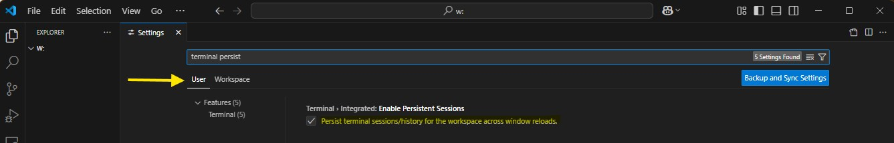
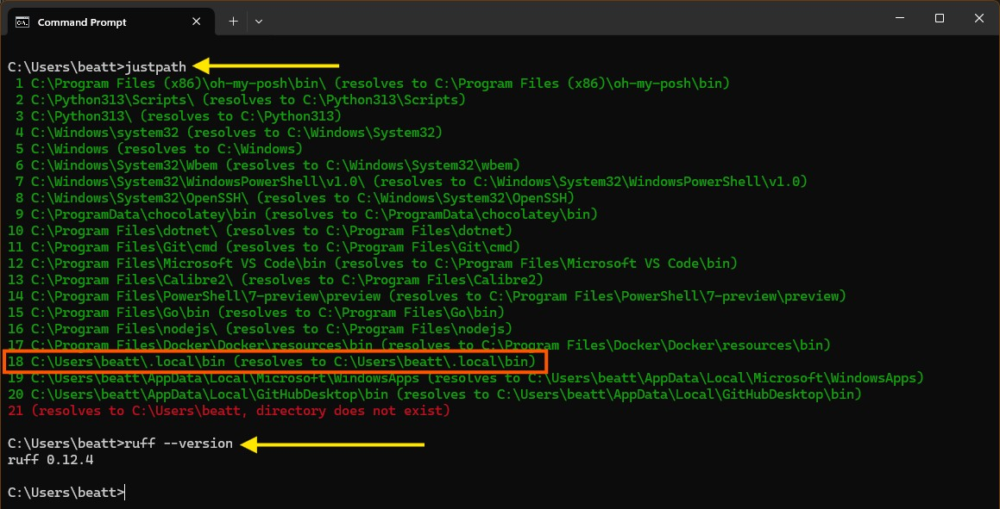
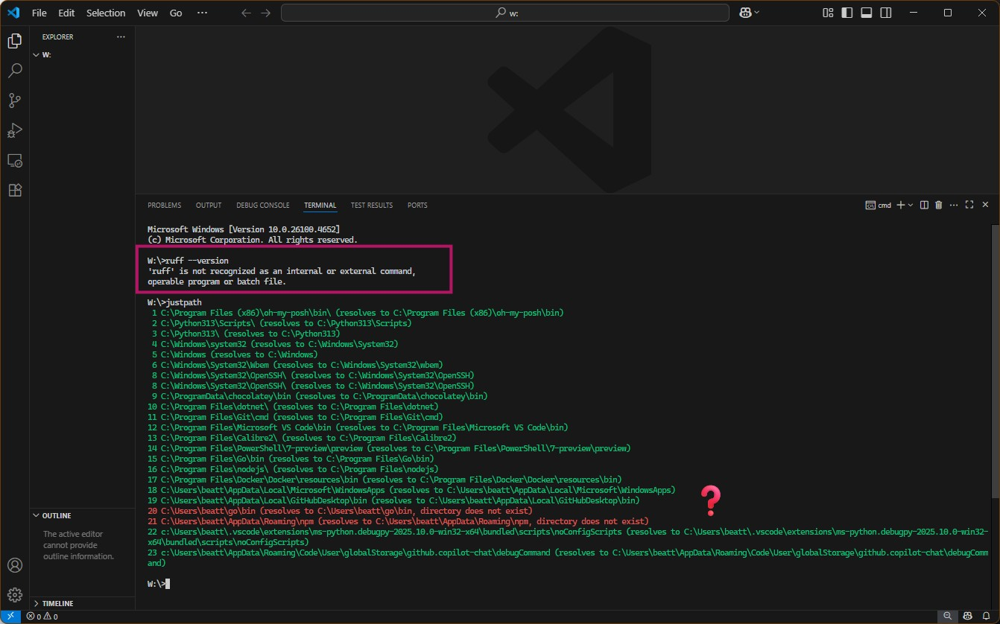

+++
date = '2025-08-29'
draft = false
title = 'VSCode Terminal Does Not Match the Windows System PATH'
tags = ["VSCode", "Settings", "Config", "Terminal"]
+++

If your Windows _PATH_ environment variable in your VSCode terminal does not match the one in your terminal outside of VSCode, it's probably this setting in VSCode:

  

_**terminal.integrated.enablePersistentSessions**_

Uncheck this or set it to be _false_, and restart VScode and all should be right.

By default, this option persists your terminal sessions across reloads ([VSCode **Terminal** Advanced Docs](https://code.visualstudio.com/docs/terminal/advanced)).  
That might be handy, so re-enabling it afterwards would be okay if you really wanted it, but for me I've disabled it in my user settings:

```json
"terminal.integrated.enablePersistentSessions": false,
```

I also changed "_Terminal: Integrated Persistent Session Revive Process_" to "_never_":

```json
"terminal.integrated.persistentSessionReviveProcess": "never",
```

----

I noticed this issue when I was installing [Ruff](https://docs.astral.sh/ruff/).  
I'd installed Ruff using [UV](https://docs.astral.sh/uv/), and set the path in a terminal outside of VSCode.  
Using the handy utility [JustPath](https://github.com/epogrebnyak/justpath), I can see the _PATH_ has been updated:



When I went to VSCode to try out Ruff, I instead got this:



The _PATH_ is different and it turned out the Terminal _enablePersistentSessions_ default setting was the reason.
